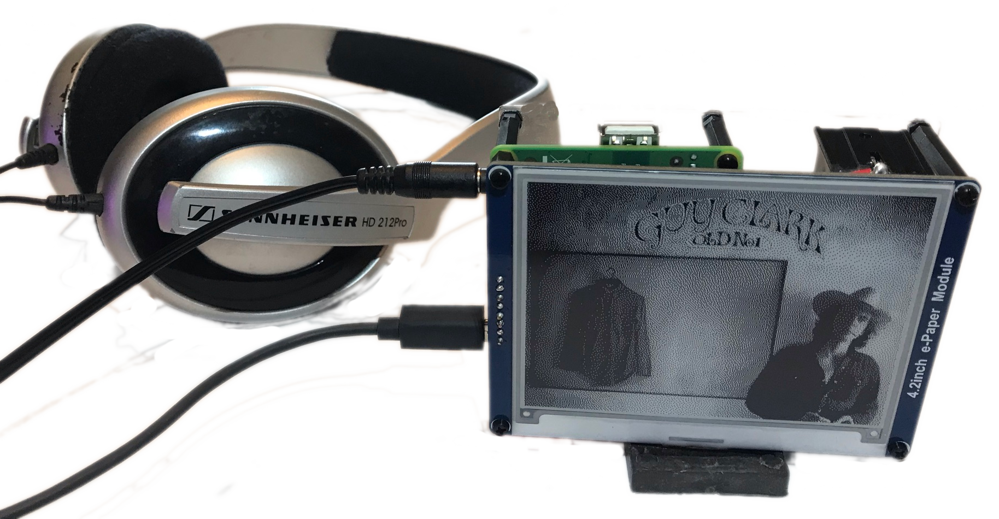

OSMC/Kodi configured with a e-Paper Waveshare 4.2 inch
https://www.waveshare.com/wiki/4.2inch_e-Paper_Module



---
# How to Use
Music and Pictures folder are shared on samba server.
To login from another PC use 'osmc' and password.  
Linux: smb://IPaddress or smb://hostname.local  
Windows: \\\\IPaddress

Copy images (400x300 pixel bmp/png) to /home/osmc/Pictures 
to be shown on the e-Paper

>For the e-ink display I use GIMP to scale the bmp or png images to 400x300 pixels (4.2in version). I also found it helps to turn the contrast up so there is some complete white (#FFFFFF) and complete black (#000000). Otherwise the image would just be varying levels of gray.

E-ink/bin has the following python scripts
* /home/osmc/E-ink/bin/e-ink-art.py (main script)
* It is enabled to start at boot using systemd service
* Instructions for getting to the web remote and ssh are on first screen along with IP address and hostname (either can be used to connect in the web )
* /home/osmc/E-ink/bin/e-ink-demo.py is a shorter delay script
* /home/osmc/E-ink/bin/e-ink-clear.py will clear the screen

Use commands below in a terminal to control main script
>Have script run at boot  
`$ sudo systemctl enable e-ink-art`
 (use disable to stop at boot)  
 To start/stop script  
 `$ sudo systemctl stop e-ink-art`  
 To clear screen  
 `$ /E-ink/bin/e-ink-clear.py`  
 To run shorter demo  
 `$ /E-ink/bin/e-ink-demo.py`

Can access web remote to play music at IP address (chorus by Jeremy Graham?)


I was using headless setup but installed vnc server so I can also access Kodi interface using vnc


---
# How to build OSMC/Kodi
Download osmc image for RPI3
https://osmc.tv/download/
This device is RPi3A+. Can run command `neofetch` to see system info.
Burn image to micro SD card, install in RPi and follow setup.
Default login is osmc/osmc  
* Enable web control
* Connect from another PC with ssh and use `passwd` to update password (can also get to terminal with Select Exit/Quit, wait for OSMC splash screen to appear, pres ESC)
* In Kodi settings for Audio output I set it to HDMI and anlogue

>Audio setup I had an issue where analog audio only worked if HDMI was plugged in during boot. I came across a suggestion to set hdmi_force_hotplug=1. Pretend HDMI connected even when headless.  
`sudo nano /boot/config.txt`  
```
hdmi_force_hotplug=1 # Pretend HDMI is always connected.
```

Install python packages needed for E-reader
>`sudo apt update`  
`sudo apt install git -y`  
`sudo apt install python3-pip -y`  
`sudo apt install gcc -y` (cross compiler)  
`sudo apt install python3-pil -y`  
`sudo apt install python3-numpy -y`  
`sudo apt install python3-setuptools -y`  
`sudo apt install python3-dev -y`  
`sudo apt install build-essential -y`  
`sudo pip3 install wheel`  
`sudo pip3 install RPi.GPIO`  
`sudo pip3 install spidev`  
alternate if pip fails  
`sudo apt install python3-wheel`  
`sudo apt-get install RPi.GPIO`  

>While installing scripts, vnc, samba I usually shut down the media center service to free up resources with  
`sudo systemctl stop mediacenter`  
You can start it back up with the "start" command or reboot.

OSMC/Kodi is intended for a typical media center with a monitor setup. Since I was using it headless I added vnc and samba to assist with copying pictures/music to the device. The chorus web remote is great for playing music/videos, as designed, but you still need a way to navigate the Kodi menu.

For vnc I followed [MarkusLange script](https://stemjust4u.com/vnc-ssh-sftp) . Details at vnc section under "other vnc options". (I tried x11vnc but it did not work). The MarkusLange script worked great and I can access the media center thru vnc now. 

To make copying pictures/music easier I setup a samba server on the Pi. Details in the file sharing section under [samba](https://stemjust4u.com/file-sharing-overgrive). I setup a share directory for both Music and Pictures.

---
# Install e-Paper library

The e-ink screen uses SPI (serial perpheral interface) for communicating.  
** IMPORTANT - ENABLE SPI **  
`sudo nano /boot/config.txt`  
```
dtparam=spi=on  
```
reboot

e-Paper directory is original clone from waveshare 
https://github.com/waveshare/e-Paper

>`sudo git clone https://github.com/waveshare/e-Paper`  
This will create an e-Paper directory

Go to the examples directory to test if the display is working  
/e-Paper/RaspberryPi_JetsonNano/python/examples  
There are epd* files for every display size.
Run the example with  
`python3 epd_<display>_test.py`  
It should show some debugging lines and start updating the screen.

---
To setup Spotify
>`sudo apt update`  
`sudo apt upgrade`  
`sudo apt install -y apt-transport-https  curl`  
`curl -sSL https://dtcooper.github.io/raspotify/key.asc | sudo apt-key add -v -`  
`echo 'deb https://dtcooper.github.io/raspotify raspotify main' | sudo tee /etc/apt/sources.list.d/raspotify.list`  
`sudo apt update`  
`sudo apt install raspotify`  
`sudo nano /etc/default/raspotify`  
(set device id and rate to 320)  
`sudo systemctl restart raspotify`  
`sudo systemctl status raspotify`  

Was having problems getting spotify audio from headphone jack and had to add a line to boot/config.txt  
>`sudo nano /boot/config.txt`  
```
hdmi_ignore_edid_audio=1  # This forces ALSA to analog on Spotify. HDMI still worked for KODI too
```

---
# Hardware Setup
## Materials
* [waveshare 4.2in e-ink screen](https://www.waveshare.com/4.2inch-e-paper-module.htm)
* Raspberry Pi 3A+ 
* 18650 Li-ion battery and holder
* Li-ion charger (there are many options. I made sure my li-ion charger supported charging while battery was in use. example from [ebay](https://ebay.us/ABf0f5) )

## Pin connection for SPI   
* e-ink  ->    GPIO (board pin #)  
* VCC    ->    3.3  
* GND    ->    GND  
* DIN    ->    10(SPI0_MOSI) (pin 19)  
* CLK    ->    11(SPI0_SCK) (pin 23)  
* CS     ->    8(SPI0_CS0) (pin 24)  
* DC     ->    25 (pin 22)  
* RST    ->    17 (pin 11)  
* BUSY   ->    24 (pin 18)  

---
# Start At Boot Using Systemd Service
The advantage to setting up a systemd service (vs cron) to start the script at boot may seem minimal. But there are some benefits to being able to start/stop/restart the script after changes.

Create the service file  
`$ sudo nano /lib/systemd/system/e-ink-art.service`

```shell
[Unit]  
Description=Display Art from Pictures Dir on WaveShare 4.2 in E-Paper  
After=mediacenter.service  

[Service]  
User=osmc  
Group=osmc  
Type=idle  
ExecStartPre=/bin/sleep 2  
ExecStart=/home/osmc/E-ink/bin/e-ink-art.py  
Restart=on-failure  

[Install]  
WantedBy=multi-user.target 
``` 
You can now control your script with systemctl commands  
`$ sudo systemctl enable e-ink-art` (start at boot)  
`$ sudo systemctl restart e-ink-art` (restart after making changes)  


